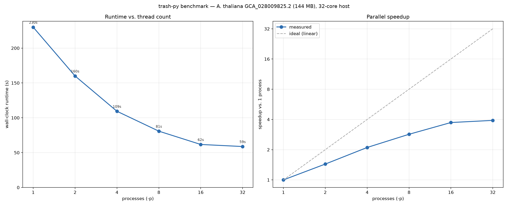

# trash-py

Tandem-repeat array identifier — a Python port of the TRASH program.

## Origin and acknowledgements

trash-py is a Python re-implementation of the TRASH program written by
Piotr Włodzimierz (<pwlodzimierz@ibb.waw.pl>, Institute of Biochemistry
and Biophysics, Polish Academy of Sciences). The upstream repository lives
at <https://github.com/vlothec/TRASH_2>. All algorithmic credit for the
underlying approach belongs to the original author; this port is an
independent rewrite (no code is byte-identical with the upstream) that
retains the structure and logic of the upstream pipeline.

The upstream MIT license is reproduced in
[`LICENSES/TRASH-UPSTREAM-MIT.txt`](LICENSES/TRASH-UPSTREAM-MIT.txt) to
satisfy its notice-preservation clause.

## What's different?
trash-py aims to build on the substantial work done in developing the original
TRASH repeat annotation pipeline by adopting a more flexible (and performant)
Python/C runner/libs framework. A library of reusable functions is exposed which
can be incorporated into diverse repeat-annotation related workflows beyond
simply running the TRASH pipeline, and the hotter functions have been ported to
C to maximise performance.

Currently, on smaller or less repetitive genomes (e.g. Arabidopsis, Human genome)
the bottleneck is nhmmer rather than the the TRASH pipeline itself, which takes
a fraction of the original time to complete.

The stderr logs have also been changed to reflect the new internals and to give
trash-py a little of its own personality.

## Installation
### conda

The best way to install the tool is using conda/mamba/micromamba:

```
conda install -c bioconda trash-py
```
### source
If instead you'd like to build/install from source, please install [nhmmer](http://hmmer.org/) and 
[Clustal Omega](https://bioconda.github.io/recipes/clustalo/README.html)
and ensure they are available on the PATH. HOR detection additionally needs
[MAFFT](https://mafft.cbrc.jp/alignment/software/) on the PATH (and `matplotlib`
for its plots — `pip install trash-py[plot]`). Additionally, please ensure you have
a suitable C compiler installed (gcc, clang) for the C extensions. 
There is no need to separately compile these, python should recognise the instructions for compilation in setup.py.

trash-py can then be installed by:

```
git clone https://github.com/mbeavitt/trash-py
cd trash-py
pip install .
```

## Usage

```
trash-py -f input.fasta -o output_dir
```

Passing `-f -` reads the fasta from stdin, so trash-py can sit in a pipeline:

```
samtools faidx genome.fa chr1 | trash-py -f - -o output_dir --name chr1
```

Gzipped input is detected automatically, whether it comes from a file or a pipe.
Output files are prefixed with the input filename (`stdin` when reading from
stdin); `--name` overrides that prefix, which is worth setting when piping so
runs don't collide.

Currently the CLI aims to mirror the one in the original TRASH tool as closely
as possible, to present a drag-and-drop replacement. trash-py adds a few options
over upstream: `-q` to silence logs, `-p` to run the array-identification and
repeat-mapping stages across multiple worker processes, and `--name` to control
the output prefix.

### HOR detection

TL;DR: replace "HORT.R" with "trash-py hor" and any previous scripts you've written should still work with the original CLI :)

Higher-order-repeat (HOR) detection can be run in one of two ways:

1. Inline HOR detection, for your convenience, as part of the main pipeline. Add a list of fasta sequence IDs (`--hor-chr-list`) to a
normal run and HOR detection is added using the most abundant class of repeats (i.e. 178_1 in Arabidopsis):

```
trash-py -f genome.fasta -o out --hor-chr-list Chr1,Chr2,Chr3
```

2. Standalone, to re-run HOR finding on an existing
`<fasta>_repeats_with_seq.csv` file without re-running the whole pipeline. `-c/--class` picks the class explicitly, e.g. `178_1`, `178_2`, `113_15`, and so on.

```
# a non-primary class across several sequences
trash-py hor out/genome.fasta_repeats_with_seq.csv -c 113_15 --chr-list Chr1,Chr2 -o out

# a single sequence (i.e., the original CLI
trash-py hor out/genome.fasta_repeats_with_seq.csv -c 113_15 --ChrA Chr1 -o out

# cross-region comparison (region A vs region B)
trash-py hor out/genome.fasta_repeats_with_seq.csv -c 113_15 --ChrA Chr1 --ChrB Chr2 -o out
```

You don't have to know the satellite class up front, if --class is not provided the tool will pick the most abundant one. Override with `--hor-class`
(pipeline) / `-c/--class` (subcommand), or run it again for another class.

For each sequence this writes `HORs_<class>_<seq>.csv` (the HOR table),
`repeats_with_hors_<class>_<seq>.csv` (per-repeat annotation), and a
`HORs_dotplot_<class>_<seq>.png` self-similarity dot-plot. MAFFT is the runtime
bottleneck, so it's run multi-threaded — `-p` in a pipeline run, `-T/--threads`
for `trash-py hor` (default: all cores). Quirks preserved from the original tool are
documented in [`docs/HOR_source_bugs.md`](docs/HOR_source_bugs.md).

## Benchmarks



Benchmarked on the *A. thaliana* GCA_028009825.2 assembly (144 MB) on a
32-core host. Increasing `-p` cuts wall-clock runtime from ~230 s at `-p 1`
to ~59 s at `-p 16`. Speedup is sub-linear and flattens beyond 16 processes,
so `-p 16` is a reasonable default on this class of host.

## How to cite

If you use `trash-py` in academic work, please cite the original TRASH
publication:

Wlodzimierz, P., Hong, M., & Henderson, I. R. (2023). TRASH: tandem
repeat annotation and structural hierarchy. *Bioinformatics*, 39(5),
btad308.

BibTeX:

```bibtex
@article{wlodzimierz2023trash,
  title={TRASH: tandem repeat annotation and structural hierarchy},
  author={Wlodzimierz, Piotr and Hong, Michael and Henderson, Ian R},
  journal={Bioinformatics},
  volume={39},
  number={5},
  pages={btad308},
  year={2023},
  publisher={Oxford University Press}
}
```

## License

`trash-py` is released under the MIT License — see [`LICENSE`](LICENSE).

## Command-line reference

```
$ trash-py --help
usage: trash-py [-h] [-V] -f FASTA -o OUTPUT [-n NAME] [-m MAX_REP_SIZE]
                [-i MIN_REP_SIZE] [-t TEMPLATES] [-q] [-p PROCESSES]
                [--hor-chr-list CHR_LIST] [--hor-ChrA CHRA] ...
                {hor} ...

TRASH — tandem-repeat array identifier (Python)

options:
  -h, --help            show this help message and exit
  -V, --version         show program's version number and exit
  -f, --fasta FASTA     input fasta; `-` reads from stdin
  -o, --output OUTPUT   output directory
  -n, --name NAME       prefix for output filenames (default: the input
                        filename, or `stdin` when reading from stdin)
  -m, --max-rep-size MAX_REP_SIZE
  -i, --min-rep-size MIN_REP_SIZE
  -t, --templates TEMPLATES
                        optional template fasta — assigns class names from
                        headers
  -q, --quiet           suppress progress output
  -p, --processes PROCESSES
                        parallel worker processes for the array-identification
                        and repeat-mapping stages (default 1 = serial)

HOR detection — a SEPARATE second stage:
  These options (all --hor-* prefixed) configure higher-order-repeat detection,
  which runs only AFTER array identification finishes. Pass --hor-chr-list (or
  --hor-ChrA) to turn the stage on. See the full list with `trash-py --help`.

subcommands:
  {hor}
    hor                 detect higher-order repeats on an existing repeat table
                        (standalone; see `trash-py hor --help`)
```

The `--hor-*` prefix is deliberate: a `--hor-*` option always configures the
downstream HOR stage, never the tandem-repeat identification above it. For a
HOR-only run on a table you already have, the standalone `trash-py hor`
subcommand takes the un-prefixed forms (`--threshold`, `--min-len`, `--ChrA`,
…) — run `trash-py hor --help` for its reference.
