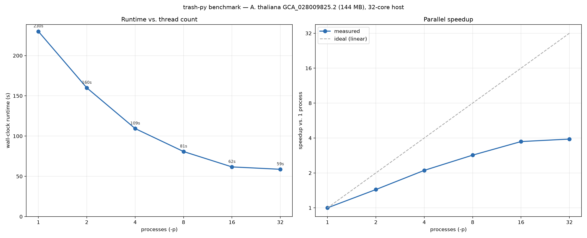

# trash-py

Tandem-repeat array identifier — a Python port of the TRASH program.

## Origin and acknowledgements

trash-py is a Python re-implementation of the TRASH program written by
Piotr Włodzimierz (<pwlodzimierz@ibb.waw.pl>, Institute of Biochemistry
and Biophysics, Polish Academy of Sciences). The upstream repository lives
at <https://github.com/vlothec/TRASH_2>. All algorithmic credit for the
underlying approach belongs to the original author; this port is an
independent rewrite (no code is byte-identical with the upstream) that
retains the structure and logic of the upstream pipeline.

The upstream MIT license is reproduced in
[`LICENSES/TRASH-UPSTREAM-MIT.txt`](LICENSES/TRASH-UPSTREAM-MIT.txt) to
satisfy its notice-preservation clause.

## What's different?
trash-py aims to build on the substantial work done in developing the original
TRASH repeat annotation pipeline by adopting a more flexible (and performant)
Python/C runner/libs framework. A library of reusable functions is exposed which
can be incorporated into diverse repeat-annotation related workflows beyond
simply running the TRASH pipeline, and the hotter functions have been ported to
C to maximise performance.

Currently, on smaller or less repetitive genomes (e.g. Arabidopsis, Human genome)
the bottleneck is nhmmer rather than the the TRASH pipeline itself, which takes
a fraction of the original time to complete.

The stderr logs have also been changed to reflect the new internals and to give
trash-py a little of its own personality.

## Installation
### conda

The best way to install the tool is using conda/mamba/micromamba:

```
conda install -c bioconda trash-py
```
### source
If instead you'd like to build/install from source, please install [nhmmer](http://hmmer.org/) and 
[Clustal Omega](https://bioconda.github.io/recipes/clustalo/README.html)
and ensure they are available on the PATH. HOR detection additionally needs
[MAFFT](https://mafft.cbrc.jp/alignment/software/) on the PATH (and `matplotlib`
for its plots — `pip install trash-py[plot]`). Additionally, please ensure you have
a suitable C compiler installed (gcc, clang) for the C extensions. 
There is no need to separately compile these, python should recognise the instructions for compilation in setup.py.

trash-py can then be installed by:

```
git clone https://github.com/mbeavitt/trash-py
cd trash-py
pip install .
```

## Usage

```
trash-py -f input.fasta -o output_dir
```

Currently the CLI aims to mirror the one in the original TRASH tool as closely
as possible, to present a drag-and-drop replacement. trash-py adds a few options
over upstream: `-q` to silence logs, `-p` to run the array-identification and
repeat-mapping stages across multiple worker processes, and `--name` to control
the output prefix.

### HOR detection

TL;DR: replace "HORT.R" with "trash-py hor" and any previous scripts you've written should still work with the original CLI :)

Higher-order-repeat (HOR) detection can be run in one of two ways:

1. Inline HOR detection, for your convenience, as part of the main pipeline. Add a list of fasta sequence IDs (`--hor-chr-list`) to a
normal run and HOR detection is added using the most abundant class of repeats (i.e. 178_1 in Arabidopsis):

```
trash-py -f genome.fasta -o out --hor-chr-list Chr1,Chr2,Chr3
```

2. Standalone, to re-run HOR finding on an existing
`<fasta>_repeats_with_seq.csv` file without re-running the whole pipeline. `-c/--class` picks the class explicitly, e.g. `178_1`, `178_2`, `113_15`, and so on.

```
# a non-primary class across several sequences
trash-py hor out/genome.fasta_repeats_with_seq.csv -c 113_15 --chr-list Chr1,Chr2 -o out

# a single sequence (i.e., the original CLI
trash-py hor out/genome.fasta_repeats_with_seq.csv -c 113_15 --ChrA Chr1 -o out

# cross-region comparison (region A vs region B)
trash-py hor out/genome.fasta_repeats_with_seq.csv -c 113_15 --ChrA Chr1 --ChrB Chr2 -o out
```

You don't have to know the satellite class up front, if --class is not provided the tool will pick the most abundant one. Override with `--hor-class`
(pipeline) / `-c/--class` (subcommand), or run it again for another class.

For each sequence this writes `HORs_<class>_<seq>.csv` (the HOR table),
`repeats_with_hors_<class>_<seq>.csv` (per-repeat annotation), and a
`HORs_dotplot_<class>_<seq>.png` self-similarity dot-plot. MAFFT and independent
HOR sweep thresholds run concurrently — `-p` in a pipeline run,
`-T/--threads` for `trash-py hor` (default: all cores). Quirks preserved from the original tool are
documented in [`docs/HOR_source_bugs.md`](docs/HOR_source_bugs.md).

## Long runs: checkpointing and resuming

A large, repeat-rich genome can take longer than a scheduler will let one
job run — CSD3's 12-hour cap, for instance. `--checkpoint` makes a run
resumable: progress is written to a checkpoint directory as it happens, the
run stops cleanly when the allocation is nearly up, and re-running the very
same command picks up where it left off.

```
trash-py -f genome.fasta -o out -p 32 --checkpoint out/checkpoint
```

* The run stops early if it hits a deadline or is signalled. It finishes the
  tasks already in flight, commits its state, and exits **75** (`EX_TEMPFAIL`)
  — distinct from success (0) and from a real failure.
* The deadline comes from `SLURM_JOB_END_TIME` when Slurm exports it (so
  nothing extra is needed inside a job), or from `--time-limit 11h`.
  `--time-margin` (default 10m) is how long before the deadline to stop,
  which has to cover saving state plus the longest single `nhmmer` call.
* `--checkpoint-signal` (default `USR1,TERM`) lists the signals that request
  the same stop, for a scheduler that warns before killing.
* Resuming re-runs the same command: the checkpoint is validated against the
  input fasta, templates, repeat-size settings and trash-py version, and a
  run that doesn't match is refused rather than silently mixed. `--restart`
  throws the state away and starts over. `-p` may change between runs.
* The checkpoint directory is deleted once the run completes; pass
  `--keep-checkpoint` to hold on to it.

Progress is tracked per sequence (window scoring), per repetitive region
(array identification) and per array (repeat mapping) — the three stages that
dominate a long run. Resumed output is byte-identical to the output of an
uninterrupted run.

### On Slurm (CSD3)

[`scripts/slurm/trash-py-csd3.sbatch`](scripts/slurm/trash-py-csd3.sbatch) is
a ready-made batch script: it asks Slurm to signal the job 15 minutes before
the limit, relays that signal to trash-py, and requeues the job when trash-py
exits 75, so a genome needing three allocations gets them without anyone
watching.

The relay matters. `#SBATCH --signal=B:USR1@900` sends `SIGUSR1` to the batch
shell, not to the program it launched, and bash only runs a trap between
commands — so trash-py has to run in the background with an explicit `wait`:

```bash
#SBATCH --signal=B:USR1@900
#SBATCH --requeue
#SBATCH --open-mode=append

trap 'kill -USR1 "$trash_pid"' USR1

trash-py -f "$GENOME" -o "$OUTDIR" -p "$SLURM_CPUS_PER_TASK" \
         --checkpoint "$OUTDIR/checkpoint" &
trash_pid=$!

wait "$trash_pid"; status=$?
while [ "$status" -gt 128 ]; do wait "$trash_pid"; status=$?; done

[ "$status" -eq 75 ] && scontrol requeue "$SLURM_JOB_ID"
```

## Benchmarks



Benchmarked on the *A. thaliana* GCA_028009825.2 assembly (144 MB) on a
32-core host. Increasing `-p` cuts wall-clock runtime from ~230 s at `-p 1`
to ~59 s at `-p 16`. Speedup is sub-linear and flattens beyond 16 processes,
so `-p 16` is a reasonable default on this class of host.

## How to cite

If you use `trash-py` in academic work, please cite the original TRASH
publication:

Wlodzimierz, P., Hong, M., & Henderson, I. R. (2023). TRASH: tandem
repeat annotation and structural hierarchy. *Bioinformatics*, 39(5),
btad308.

BibTeX:

```bibtex
@article{wlodzimierz2023trash,
  title={TRASH: tandem repeat annotation and structural hierarchy},
  author={Wlodzimierz, Piotr and Hong, Michael and Henderson, Ian R},
  journal={Bioinformatics},
  volume={39},
  number={5},
  pages={btad308},
  year={2023},
  publisher={Oxford University Press}
}
```

## License

`trash-py` is released under the MIT License — see [`LICENSE`](LICENSE).

## Command-line reference

```
$ trash-py --help
usage: trash-py [-h] [-V] -f FASTA -o OUTPUT [-n NAME] [-m MAX_REP_SIZE]
                [-i MIN_REP_SIZE] [-t TEMPLATES] [-q] [-p PROCESSES]
                [--checkpoint [DIR]] [--restart] [--keep-checkpoint]
                [--checkpoint-interval SECONDS] [--time-limit DURATION]
                [--time-margin DURATION] [--checkpoint-signal LIST]
                [--hor-chr-list CHR_LIST] [--hor-ChrA CHRA] ...
                {hor} ...

TRASH — tandem-repeat array identifier (Python)

options:
  -h, --help            show this help message and exit
  -V, --version         show program's version number and exit
  -f, --fasta FASTA     input fasta; `-` reads from stdin
  -o, --output OUTPUT   output directory
  -n, --name NAME       prefix for output filenames (default: the input
                        filename, or `stdin` when reading from stdin)
  -m, --max-rep-size MAX_REP_SIZE
  -i, --min-rep-size MIN_REP_SIZE
  -t, --templates TEMPLATES
                        optional template fasta — assigns class names from
                        headers
  -q, --quiet           suppress progress output
  -p, --processes PROCESSES
                        parallel worker processes for the array-identification
                        and repeat-mapping stages (default 1 = serial)

checkpointing:
  Survive an HPC wall-clock limit: save progress as the run goes, stop cleanly
  when the scheduler warns us, and resume where it stopped when the same
  command runs again.

  --checkpoint [DIR]    record resumable progress in DIR and resume from it if
                        it already holds state for this run (default DIR:
                        <output>/<name>.checkpoint)
  --restart             discard any existing checkpoint and start from scratch
  --keep-checkpoint     keep the checkpoint directory after a successful run
                        (it is deleted by default)
  --checkpoint-interval SECONDS
                        how often to commit progress to disk (default 300s)
  --time-limit DURATION
                        wall-clock budget for this run, e.g. 11h, 690m,
                        11:30:00, or a bare number of seconds; when unset,
                        SLURM_JOB_END_TIME is used if the scheduler exported it
  --time-margin DURATION
                        stop this long before the deadline, to leave room for
                        saving state and for in-flight tasks to finish
                        (default 10m)
  --checkpoint-signal LIST
                        comma-separated signals that request a checkpoint-and-
                        stop (default USR1,TERM)

HOR detection — a SEPARATE second stage:
  These options (all --hor-* prefixed) configure higher-order-repeat detection,
  which runs only AFTER array identification finishes. Pass --hor-chr-list (or
  --hor-ChrA) to turn the stage on. See the full list with `trash-py --help`.

subcommands:
  {hor}
    hor                 detect higher-order repeats on an existing repeat table
                        (standalone; see `trash-py hor --help`)
```

The `--hor-*` prefix is deliberate: a `--hor-*` option always configures the
downstream HOR stage, never the tandem-repeat identification above it. For a
HOR-only run on a table you already have, the standalone `trash-py hor`
subcommand takes the un-prefixed forms (`--threshold`, `--min-len`, `--ChrA`,
…) — run `trash-py hor --help` for its reference.
